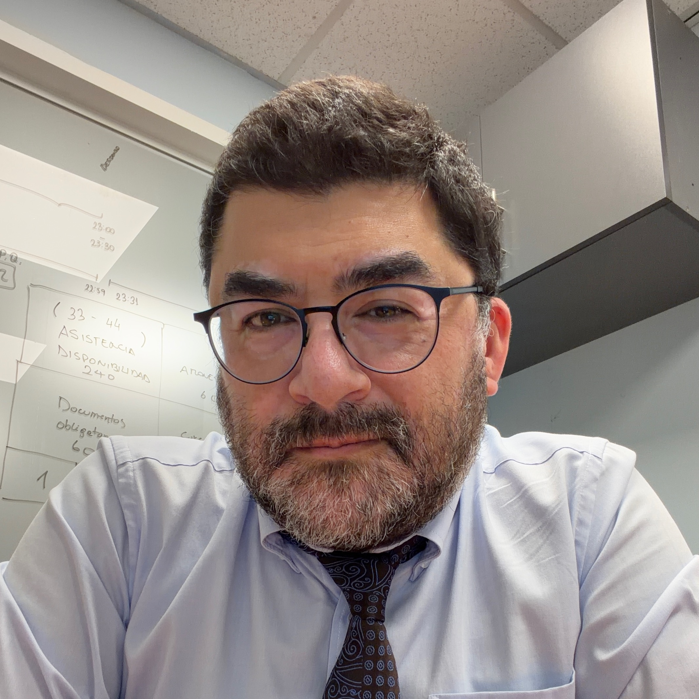

# Sobre el Autor

## Juan Carlos Carvajal
**Ingeniero Civil Electrónico, MSc. Telecomunicaciones**

*Arquitecto de Sistemas Estratégicos y de Decisión.*

*Especialista en Gobernanza de IA, Ciberseguridad y Riesgo.*

---

### Visión

Opero en la intersección crítica donde el **Diseño de Sistemas** choca con el **Comportamiento Operativo** bajo presión.

Mi trabajo no consiste en gestionar el clima emocional mediante declaraciones de valores o retórica corporativa, sino en ejecutar una **Arquitectura Forense del Comportamiento**. Me dedico a auditar la tríada estructural real —incentivos, flujos de información y asignación de consecuencias— que determina de forma inexorable la conducta táctica de una organización.

Este proyecto, **[Cultura Operativa](https://cultura.jccarvajal.com)**, sistematiza esa práctica: erradicar el misticismo organizacional, desmantelar la dilución estructural de responsabilidad en la toma de decisiones y proporcionar los instrumentos de reingeniería necesarios para hacer que el desvío sea estructuralmente inviable.

---

### Conecta conmigo

* 🌐 **Web Personal:** [www.jccarvajal.com](https://www.jccarvajal.com/)
* 💼 **LinkedIn:** [linkedin.com/in/jccarvajal](https://www.linkedin.com/in/jccarvajal)
* 🐙 **GitHub:** [github.com/jccarvajal](https://github.com/jccarvajal)
* 🦋 **Bluesky:** [@jccarvajal.com](https://bsky.app/profile/jccarvajal.com)
* 📧 **Correo:** [jccarvajal@gmail.com](mailto:jccarvajal@gmail.com)

---
📍 **Ubicación:** Valparaíso, Chile